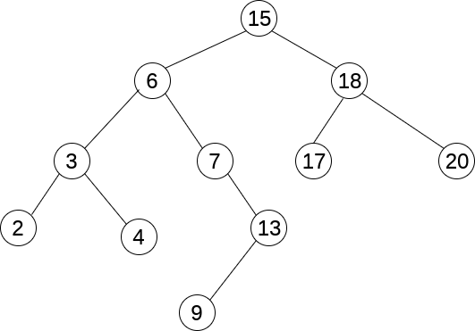
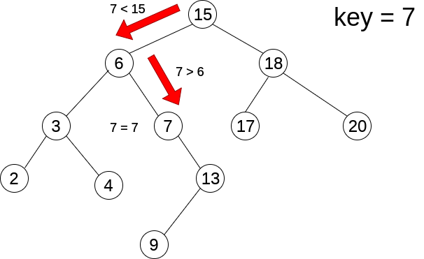
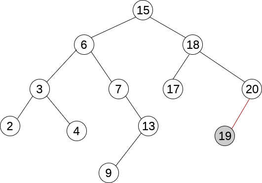

二叉搜索树是一种被用于查找的二叉树。其要求是：每个节点都大于其左子树，小于或等于右子树。

### 1. 查找

从根节点开始查找。如果关键值等于当前节点值，说明查找成功。如果关键值小于当前节点值，则在当前节点的左子树上查找。如果关键值大于当前节点，则在当前节点的右子树上查找。

### 2. 插入

插入的节点一定是叶子节点。二叉搜索树插入前需要先进行查找，最后查找到的叶子节点即为插入节点的位置。

